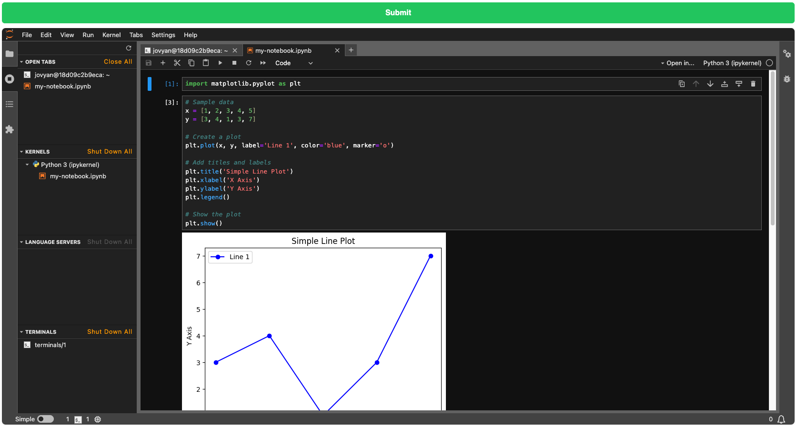

# Description

PoC JupyterLab embedded usin a iframe inside an Angular App

## Start JupyterLab Server

Create a volume to save Jupyter notebooks
```
$ docker volume create jupyter_notebooks
```

Start JupyterLab Server to be serve using a iframe
```
$ docker run -d \
--name jupyter \
-p 8888:8888 \
-v jupyter_notebooks:/home/jovyan/work \
-v ${PWD}/jupyter/jupyter_server_config.py:/home/jovyan/.jupyter/jupyter_server_config.py \
jupyter/base-notebook
```

